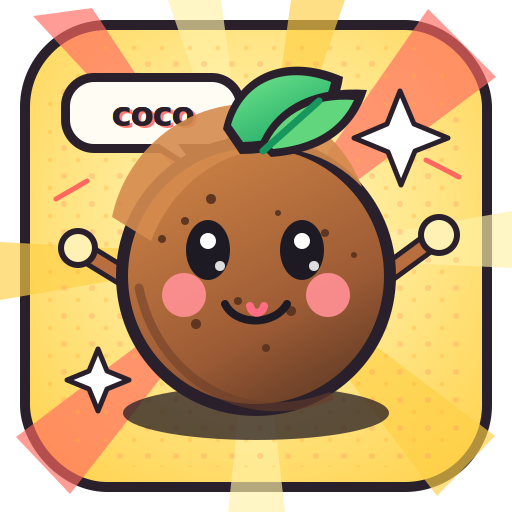

<p align="center">
  
</p>

<h1 align="center">coco</h1>

<p align="center">
  A tiny, strict referee for AI coding agents: plan → implement → review → verify → human merge.
</p>

<p align="center">
  Codex / Claude Code do the work. Oracle reviews. coco refuses unsafe next steps.
</p>

---

## What coco is

coco is a local workflow layer for using coding agents every day without trusting chat memory.

It gives you a small state machine around agentic development:

1. turn vague work into a verifiable goal;
2. put loop-sized tasks in a project queue;
3. let the agent implement exactly one task;
4. require strict Oracle review;
5. let coco run verification itself;
6. stop at a human merge gate, unless you explicitly opted into low-risk auto-merge for that one goal.

coco is not a code generator. It is the guardrail around one.

## Why it exists

Coding agents are powerful, but long sessions fail in predictable ways:

- the agent forgets what phase it is in;
- a review result from an old tree gets reused after new changes;
- tests are described as passing instead of actually run by the tool;
- merge consent becomes vague;
- background work drifts outside the intended scope;
- useful learnings disappear into chat history.

coco makes those parts explicit and durable. The current HEAD/tree, review verdict, verify result, branch state, queue task, audit trail, and merge gate all live in local artifacts and deterministic commands.

## The mental model

| Layer | Skill / command | Job |
|---|---|---|
| CEO | `$coco-goal` | Turn a fuzzy intent into a strong GoalSpec and loop-sized backlog tasks. |
| Queue | `$coco-queue` / `coco next` | Show the next ready task without implementing it. |
| CTO | `$coco-loop` | Implement one task through review, verify, and merge gate. |
| Night | `$coco-night` | Pick one ready task and run one bounded overnight attempt. |
| PM | `$coco-store` / `coco-store` | Specs, roadmap, backlog, links, context packs, project graph. |
| Improve | `$coco-improve` | Use valid audit + feedback to propose one eval-backed workflow improvement. |

## Real-world examples

### “I have a vague idea”

```text
$coco-goal Make the project easier to use every day in Codex.app
```

coco-goal reads the repo, researches current constraints when needed, writes a GoalSpec, archives it in `coco-store`, and promotes loop-sized tasks to the backlog. It does not start implementation.

### “What should I work on next?”

```text
$coco-queue
```

coco-queue reads the backlog and project store, shows the next ready task, explains why it is ready, and stops.

### “Implement the next task”

```text
$coco-loop
```

coco-loop asks coco for the next ready backlog task and runs exactly one implementation loop.

### “Work on one thing while I sleep”

```text
$coco-night
```

coco-night is a safe wrapper around queue + loop. It picks one ready task, runs one bounded attempt, and leaves a wake-up report. By default it stops at the merge gate.

For a low-risk task where you explicitly want one-goal auto-merge consent:

```text
$coco-night --auto
```

Auto-merge still requires clean review, coco-owned verify, base ancestry, per-goal consent, and the risk policy. Risky work falls back to the human merge path.

If the queue is empty and you want coco to pick one small next task:

```text
$coco-night --plan-next
```

That first creates one next task through the goal-planning path, then attempts only that task.

### “Improve coco using its own history”

```text
coco audit validate
coco audit feedback --goal <goalId> --kind goal-quality --rating 2 --tags vague-goal,weak-proof
$coco-improve
```

coco-improve acts only on valid audit data and safe signals. It proposes one local improve-spec and one backlog task. It does not edit code or merge.

## Install

```sh
npm install -g @nickcao/coco
```

Requires Node.js 20 or newer and Git.

For the full loop you also need:

- OpenAI Codex or Claude Code;
- the `coco` MCP server configured;
- Oracle configured for deep review;
- the coco skills installed or synced;
- a committed `coco.config.json` with `verify.testCommand`.

## First setup in a repo

```sh
cd your-repo
coco init
coco setup codex
coco setup codex --apply
coco doctor
```

`coco init` creates `.coco/` runtime state and a starter `coco.config.json`.

Set your verify command:

```json
{
  "verify": {
    "testCommand": "pnpm test",
    "timeoutSec": 600,
    "outputLimitBytes": 65536
  },
  "workflow": {
    "baseBranch": "main"
  }
}
```

## Daily workflow

```sh
coco doctor             # check local wiring
coco-store status       # project pulse
coco next               # next ready backlog task
```

Then use one of the skills:

```text
$coco-goal <intent>     # define and queue work
$coco-queue             # inspect next task
$coco-loop              # implement one queued task
$coco-night             # one bounded overnight attempt
$coco-improve           # propose one workflow improvement
```

## The safety contract

coco is intentionally conservative.

- Review verdicts must come from strict Oracle output parsing.
- Verify is coco-owned; the agent cannot self-report `pass`.
- Review and verify are bound to the current HEAD/tree.
- Dirty trees, wrong branches, stale reviews, missing verify config, and rebase needs block progress.
- Merge requires active goal, correct branch, clean tree, current-epoch implementation, clean review, passing verify, and base ancestry.
- Changing `verify.testCommand` requires explicit human acknowledgement with `--ack-verify-policy-change`.
- Auto-merge is opt-in per goal and still risk-gated.
- Self-improvement cannot touch protected referee/metrics/store/improve-self paths.
- Audit data is local, redacted, and validated before it drives improvement.

## What the progress card looks like

coco returns machine-readable status, and the skills echo compact cards in Codex.app / Claude Code:

```text
◈ coco-loop  ·  goal-20260708-2214-add-night-mode
  Checkpoint   ready — merge gate
  Branch       coco/goal-... → main (on goal)
  Verified     plan ✓   implement ✓   review ✓ clean   verify ✓ pass
  Remaining    merge
  Risk         —
  Recovery     coco merge --goal goal-20260708-2214-add-night-mode
  Next         merge-gate — awaiting human approval

  source: goal-... · a1b2c3d · state=active · next=merge-gate
```

The merge command is still a separate human approval step.

## CLI cheat sheet

```sh
# repo setup
coco init
coco setup codex
coco doctor

# queue and loop
coco next
coco goal status --goal <goalId>
coco goal verify --goal <goalId> --expected-sha <sha>
coco merge --goal <goalId>
coco merge --goal <goalId> --ack-verify-policy-change

# audit and self-improvement
coco audit report
coco audit validate
coco audit feedback --goal <goalId> --kind status-clarity --rating 5 --tags clear-card
coco improve digest
coco improve check <paths>
coco eval

# PM layer
coco-store status
coco-store progress
coco-store viz
coco-store pack --goal <goalId> --query "<objective>"
```

## Files and directories

| Path | Purpose |
|---|---|
| `.coco/` | Local runtime state, goal ledgers, verify runs, audit logs. Gitignored. |
| `.coco-store/` | Local PM store: specs, resources, links, roadmap context. |
| `coco.config.json` | Committed repo policy: verify command, workflow base branch, auto-merge policy. |
| `AGENTS.md` | Durable repo guidance for Codex/agents. |
| `skills/` | coco skills to install/sync into your agent skills directory. |
| `docs/self-evolution.md` | How audit + feedback become eval-backed improvement proposals. |

## Development

```sh
pnpm install
pnpm typecheck
pnpm test
pnpm eval
pnpm build
pnpm run ci   # typecheck + test + eval + build (use `run` — pnpm's built-in `ci` reinstalls instead)
```

GitHub Actions runs the CI gate on Ubuntu and macOS with Node 22/24.

## Platform support

coco is macOS/Linux-first. Windows native support is not guaranteed yet; use WSL. See `docs/platform-support.md`.

## Privacy

The full loop can send bounded context and diffs to Oracle for plan/review. Local audit logs, local store cards, runtime state, and secrets must not be sent. See `docs/privacy-model.md`.

## Credits

- Review + plan brain: Oracle (`@steipete/oracle`) with ChatGPT Pro.
- Icon generated with ChatGPT and refined for the comic-style coco mascot.

## License

MIT © nickcao
